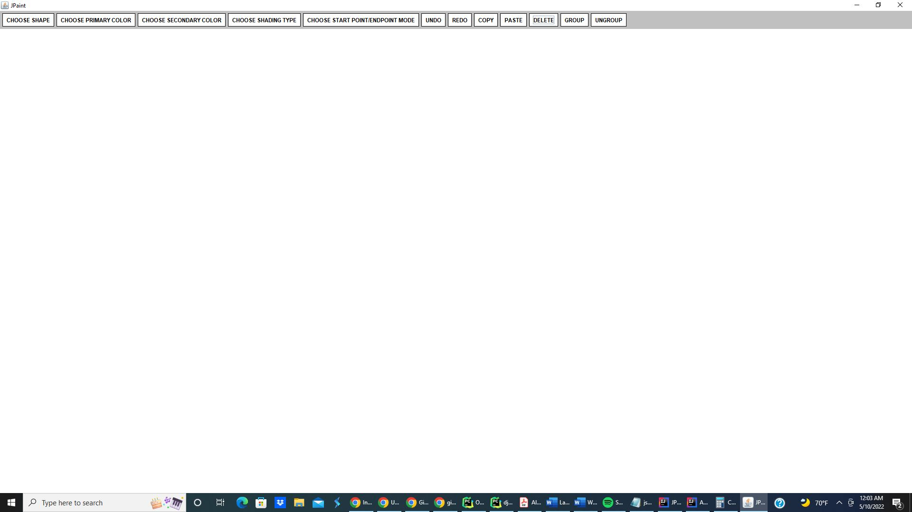
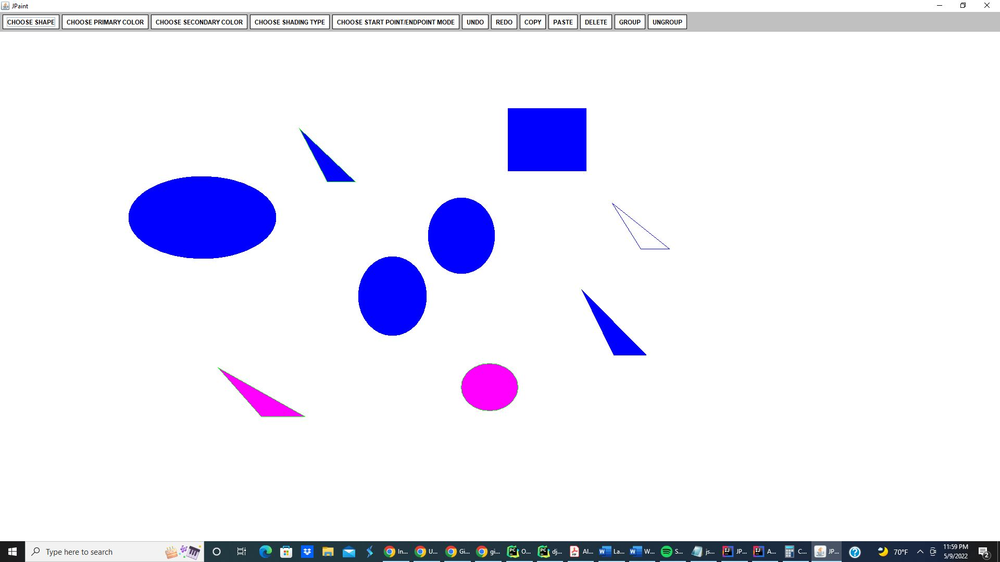
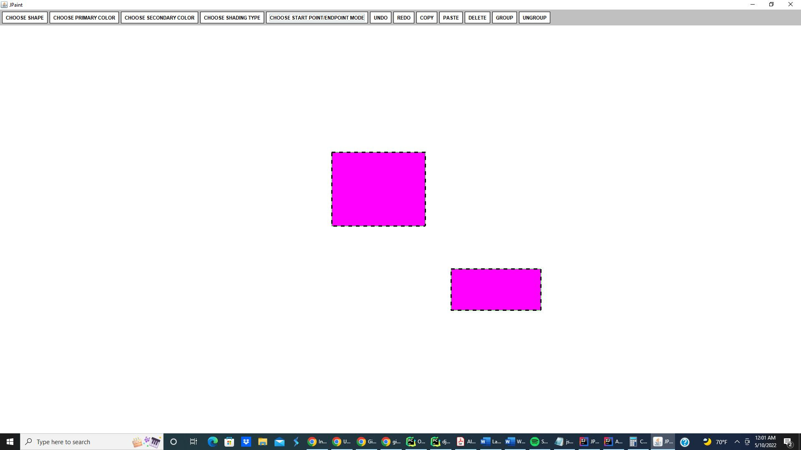

# JPaint

This is a shape drawing application developed via Java and its native libraries. It allows the user to draw triangles, rectangles, and circles. The shapes can be drawn with
a variety of different colors and can be drawn in three different drawing styles: Filled in shapes, outline only shapes with no filling, and shapes with both a filling 
and a outline. A secondary color can be used if the outline and filled in option is selected. 

The shapes can be selected and moved in a draw and drop fashion. Furthermore there is functionality to copy and paste shapes and also menu functionality for undo/redo events. 
There is also an option to delete shapes once selected. 

The application incorporates a GUI that is built via the Java swing toolkit's libraries and classed. The app also utilizes the mouseAdapter class which is part of the 
kava.awt.event package in order to register mouse events and clicks. 

## Screenshots of Functionality

**This is the blank canvas GUI and the menu toolbar with no shapes drawn** 

**Canvas with different shapes drawns with different colors and fill options**

**Shapes are selected where they can be moved or deleted**

